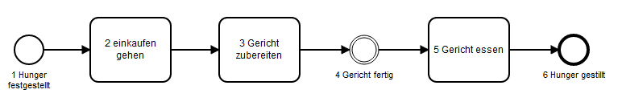

Ein einfacher Ablauf in BPMN

Beginnen wir unser BPMN-Tutorial mit einem recht einfachen Prozessdiagramm:

 </img>

Hunger bemerkt Lebensmittel einkaufen Mahlzeit vorbereiten Mahlzeit zubereiten Mahlzeit essen Hunger gestillt

Dieses Diagramm zeigt einen einfachen Prozess, der dadurch ausgelöst wird, dass jemand hungrig ist. Das Ergebnis ist, dass jemand Lebensmittel einkaufen und eine Mahlzeit zubereiten muss. Danach isst die Person die Mahlzeit und hat ihren Hunger gestillt.
Bewährte Praxis: Benennungskonventionen
Bei der Benennung von Aufgaben versuchen wir, uns an das objektorientierte Designprinzip zu halten und das Muster [Verb] + [Objekt] zu verwenden. Wir würden z. B. sagen: "Besorgen Sie Lebensmittel", nicht: "Kümmern Sie sich zuerst um den Einkauf von Lebensmitteln".
Ereignisse beziehen sich auf etwas, das unabhängig vom Prozess bereits geschehen ist (wenn es sich um fangende Ereignisse handelt) oder als Ergebnis des Prozesses (wenn es sich um werfende Ereignisse handelt). Aus diesem Grund verwenden wir das [Objekt] und machen das [Verb] im Passiv, wir schreiben also "Hunger bemerkt". BPMN verlangt nicht, dass Sie Start- und Endereignisse für einen Prozess modellieren - Sie können sie weglassen - aber wenn Sie ein Startereignis modellieren, müssen Sie ein Endereignis für jeden Pfad modellieren. Das Gleiche gilt für Endereignisse, für die Startereignisse erforderlich sind. Wir erstellen unsere Modelle immer mit Start- und Endereignissen, und zwar aus zwei Gründen: Erstens lässt sich auf diese Weise der Prozessauslöser bestimmen, und zweitens können Sie den Endstatus jedes Pfadendes beschreiben. Nur bei Sub-Prozessen verzichten wir manchmal auf diese Praxis. Dazu später mehr.
 FAQ: Ist es zwingend erforderlich, BPMN-Diagramme horizontal zu zeichnen? Was ist, wenn ich sie lieber vertikal zeichne?
Sie können Ihre Diagramme immer von oben nach unten statt von links nach rechts zeichnen - der BPMN 2.0-Standard verbietet das nicht. Wir empfehlen es jedoch nicht: Es ist sehr unüblich, und die Erfahrung hat gezeigt, dass die Menschen den Prozessfluss besser verstehen, wenn er auf dieselbe Weise beschrieben wird wie ein geschriebener Text (von links nach rechts, zumindest in der westlichen Welt).

