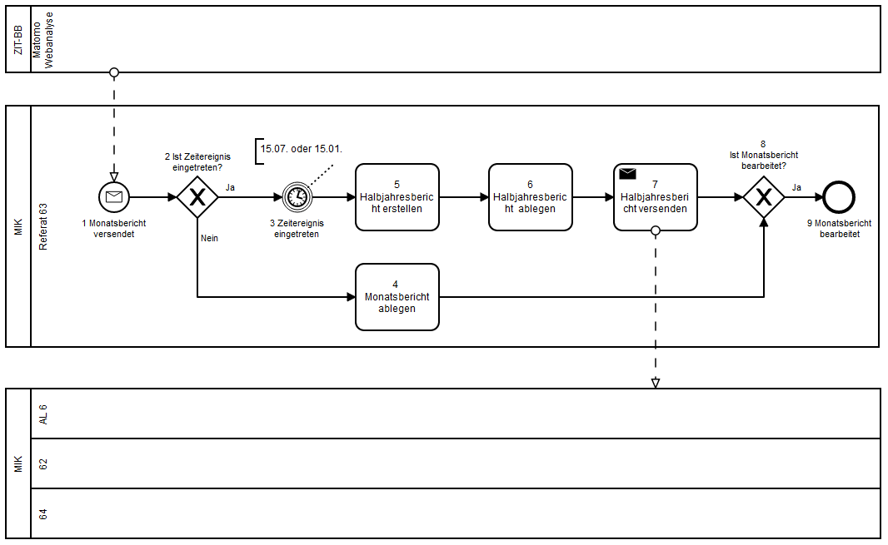
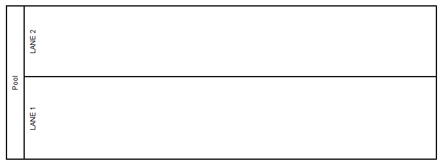
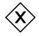
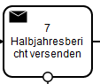
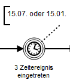
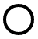
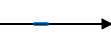
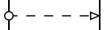

<h3>Ablauf mit Verantwortlichkeiten, Verzweigungen, Zeitereignis und Benachrichtigungen</h3>
<h4>Diagramm </h4> <b>Prozess "Webanalysebericht bearbeiten"</b>
 </img>

<h4>Prozessbeschreibung mit weiteren Detaills</h4>

<li>
1 Monatsbericht versendet
Monatlich versendeter Matomobericht wird per Email an dass Webredaktionspostfach gesendet
 
</li><li>
2 Ist Zeitereignis eingetreten? 
 </li><li>
3 Zeitergnis eingetreten 
 </li><li>
4 Monatsbericht ablegen
 </li><li>
5 Halbjahresbericht erstellen
 </li><li>
6 Halbjahresbericht ablegen
 </li><li>
7 Halbjahresbericht versenden
 </li><li>
8 Ist Monatsbericht bearbeitet?
 </li><li>
9 Monatsbericht bearbeitet
</li>

<h3>Verwendete Symbole</h3>
 Pool mit 2 Lane <b>[Objekt]</b>  </img> 
 Verzweigung (exklusiv) <b> [Nr] + [Zustandsabfrage]</b>  </img>
 Startereignis , ausgelöst durch den Empfang einer Nachricht<b>[Nr] + [Objekt] + [Verb im Passiv]</b>  </img>
 Aufgabe <b>[Nr]  + [Objekt] + [Verb]</b>  </img>
 Aufgabe die Nachricht versendet<b>[Nr]  + [Objekt] + [Verb]</b>  </img>
 Zwischenereignis nach Zeitablauf mit Kommentar, wann diese Zeitereignisse ausgelöst werden <b>[Nr] + [Objekt] + [Verb im Passiv]</b>  </img>
 Endereignis <b>[Nr] + [Objekt] + [Verb im Passiv]</b>  </img>
 Ablaufrichtung  </img>
 Nachrichtenfluss  </img>
 
