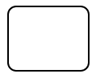

<h3>Ablauf mit Verantwortlichkeiten, Verzweigungen, Ereignisbearbeitung und Benachrichtigungen</h3>
<h4>Diagramm </h4> <b>Prozess "Nutzeranalyseberichte bearbeiten"</b>
 </img>

<h4>Prozessbeschreibung mit weiteren Detaills</h4>

<li>
1 Prozess zur "Nutzeranalyseberichte bearbeiten" gestartet
 
</li><li>
2 Nutzeranalyse gestartet? 
 </li><li>
3 Zeitergnis eingetreten? 
 </li><li>
4 Monatsbericht ablegen
 </li><li>
5 Halbjahresbericht erstellen
 </li><li>
6 Halbjahresbericht ablegen
 </li><li>
7 Halbjahresbericht versenden
 </li><li>
8 Ablage?
 </li><li>
9 Prozess beenden?
 </li><li>
10 Nutzeranalyse beendet
</li>

<h3>Verwendete Symbole</h3>
 Pool mit 2 Lane <b>[Objekt]</b>  </img> 
 <em>Visualisiert die Verantwortlichkeiten der enthaltenen Aktivitäten und Aufgaben</em>
 Verzweigung (exklusiv) <b> [Nr] + [Zustandsabfrage]</b>  </img>
 
<em>Bedingungsabfrage: es wird nur ein Zweig durchlaufen </em>
 

 Verzweigung (Ereignisbasierend) <b> [Nr] + [Zustandsabfrage]</b>  </img>
 
<em>Jeder Zweig für den ein Zwischenereignis existiert wird durchlaufen</em>
 

 Startereignis <b> [Nr] + [Objekt] + [Verb im Passiv]</b>  </img>
 <em>Jeder Prozess muss gestartet werden. Dies kann bei einem reinem Verwaltungsprozess allein durch die Bestätigung aller Beteiligten passieren, ab einem definierten Zeitpunkt diesen modellierten Prozess durchzuführen.
 </em>
 Aufgabe <b> [Nr]  + [Objekt] + [Verb]</b>  </img>
 Aufgabe die Nachricht versendet <b> [Nr]  + [Objekt] + [Verb]</b>  </img>
 Zwischenereignis nach Erhalt einer Nachricht <b> [Nr] + [Objekt] + [Verb im Passiv]</b>  </img>
 Zwischenereignis nach Zeitablauf mit Kommentar, wann diese Zeitereignisse ausgelöst werden <b> [Nr] + [Objekt] + [Verb im Passiv]</b>  </img>
 Endereignis <b> [Nr] + [Objekt] + [Verb im Passiv]</b>  </img>
 Ablaufrichtung  </img>
 Nachrichtenfluss  </img>
 
